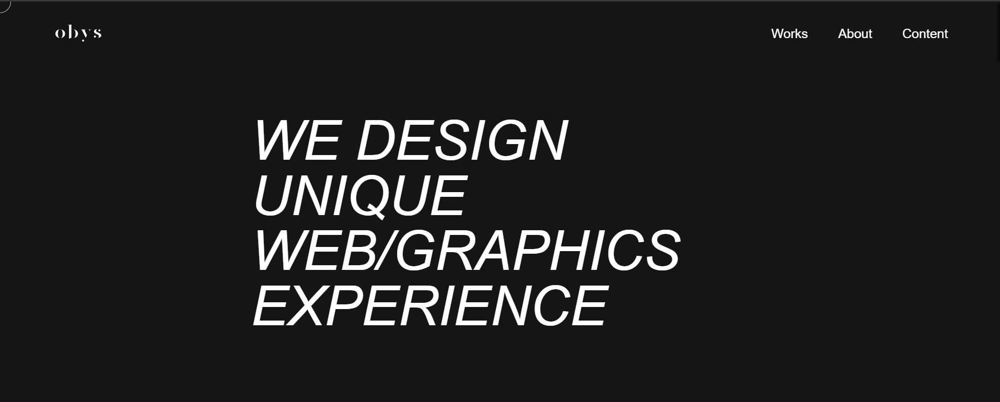

# 🎨 OBEY AGENCY

<div align="center">


A stunning, responsive portfolio website with smooth animations and modern design elements.


</div>

---

## ✨ Preview  

<div align="center">

  

</div>

---

## 🌟 Features  

### 🎯 Interactive Elements  
- 🖱️ **Custom Cursor** – Blend-mode cursor with smooth tracking  
- ✨ **Smooth Animations** – GSAP-powered transitions and loaders  
- 🎬 **Video Integration** – Custom video player with hover effects  
- 🔄 **Interactive Sections** – Hover effects and scroll animations  

### 🎨 Design Excellence  
- 🎪 **Modern UI/UX** – Clean, minimalist dark theme  
- 🎭 **Typography** – Silk Serif & Plain Light fonts  
- 🎡 **Circular Elements** – Interactive hover states  
- 🌈 **Visual Effects** – Blend modes and smooth transitions  

### 📱 Responsive Design  
- 📱 **Mobile-First** – Perfect on all devices  
- 🖥️ **Tablet Optimized** – Great experience on tablets  
- 💻 **Desktop Enhanced** – Full animations and hover effects  
- 🎯 **Touch Friendly** – Optimized for all touch devices  

---

## 🚀 Live Demo  

[](#)

---

## 🛠️ Tech Stack  

<div align="center">


</div>

---

## 📁 Project Structure  

```bash
portfolio-website/
│
├── 📄 index.html              # Main HTML file
├── 🎨 styles.css              # Main stylesheet
├── ⚡ script.js               # JavaScript functionality
├── 📜 LICENSE                 # MIT License
├── 🔒 .gitignore              # Git ignore rules
│
├── 📁 fonts/                  
│   ├── plain-regular-webfont.ttf
│   ├── plain-light-webfont.ttf
│   ├── silkserif-regularitalic-webfont.ttf
│   └── silkserif-lightitalic-webfont.ttf
│
└── 📁 images/                 
    ├── hero-image.jpg
    └── project-images/

```

---

🎬 Sections Overview

| Section            | Features                  | Animation            |
| ------------------ | ------------------------- | -------------------- |
| 🎪 Loader          | Elegant loading animation | GSAP Powered         |
| 🧭 Navigation      | Responsive, smooth        | Hover effects        |
| 🌟 Hero            | Typography animations     | Text reveal          |
| 🎬 Video Showcase  | Interactive player        | Custom cursor        |
| 🖼️ Portfolio      | Image grid                | Hover transitions    |
| 👨‍💻 About        | Content layout            | Scroll animations    |
| 🎯 Services        | Circular elements         | Scale animations     |
| 🌀 Infinite Scroll | Text marquee              | Continuous animation |
| 📞 Footer          | Contact links             | Smooth transitions   |


---

📱 Responsive Breakpoints
| Device          | Breakpoint | Features        |
| --------------- | ---------- | --------------- |
| 📱 Mobile       | <480px     | Stacked layout  |
| 📱 Large Mobile | 480–767px  | Enhanced layout |
| 📟 Tablet       | 768–1024px | Hybrid layout   |
| 💻 Desktop      | 1024px+    | Full effects    |

---

📜 License

This project is licensed under the MIT License - see the LICENSE
 file for details.
 
 MIT License  

Copyright (c) 2024 Ayush-Raghuwanshi-Dev  

Permission is hereby granted, free of charge, to any person obtaining a copy
...
SOFTWARE.

---
🌟 Show Your Support

If you like this project, please give it a ⭐️

<div align="center"> ⭐️ **Star this repository!** ⭐️ </div>
<div align="center"
</div>
    
    ---

🙏 Acknowledgments

🎨 Design inspiration: Modern Portfolio Trends

🖋️ Fonts: Custom typography (Silk Serif, Plain Light)

🧩 Icons: Font Awesome

⚡ Animations: GSAP, Locomotive Scroll

---

<div align="center">

🎓 Ayush Raghuwanshi
Computer Science & Engineering (IoT)

Made with ❤️ and ☕ by Ayush Raghuwanshi

"Code is like humor. When you have to explain it, it's bad." — Cory House

---

</div>
🎯 Project Status

Last updated: November 2025

<div align="center"> ⭐ Don't forget to star this repo if you found it helpful! ⭐ </div> ```
